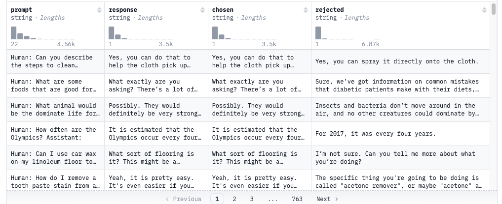

对google提供的Deepspeed-Chat代码进行学习，同时在AUTO-DL平台进行SFT  
目前打算分别通过DeepSpeed-Chat框架训练英文和中文模型各一个，需要选择较小的模型+数据集

# DeepSpeed-Chat

DeepSpeed-Chat是微软于2023年发布的基于Deepspeed用于训练类ChatGPT模型的开发工具，其具有以下三大核心功能:  

- 易用的类ChatGPT模型的训练和强化推理：只需要一个脚本就可以实现多个训练步骤，包括使用Huggingface预训练的模型，使用InstructGPT训练的所有三个步骤构建类ChatGPT模型。此外，还提供了一个易于使用的推理API，用于用户在模型训练后对话式交互性测试。
- DeepSpeed-RLHF管道：DeepSpeed-RLHF复现了InstructGPT论文中的训练模式，包括监督微调、奖励模型微调以及基于人类反馈的强化学习三个步骤。此外，还提供了数据抽象和混合功能，以支持用户使用多个不同来源的数据源进行训练。
- DeepSpeed-RLHF系统：将DeepSpeed的训练（Training Engine）和推理能力（Inference Engine)整合到统一的混合引擎（DeepSpeed Hybrid Engine，DeepSpeed-HE）中用于RLHF训练。DeepSpeed-HE能够无缝地在推理和训练模式之间切换，使其能够利用来自DeepSpeed-Inference的各种优化。

复现InstructGPT三个步骤:  


具体来说:  

1.监督微调(SFT): 使用精选的人类回答类微调预训练的语言模型以应对各种查询  
2.奖励模型微调: 使用一个包含人类对同一个查询的多个答案打分的数据集来训练一个独立的奖励模型(RW)  
3.RLHF训练: 利用PPO算法，根据RW模型的奖励反馈进一步微调SFT模型

# 代码分析

详细看下Deepspeed-Chat代码

## SFT

### 启动脚本

```bash
# 梯度累计的步骤数，即每8个batch计算一次梯度，反向传播参数，适用于显存有限情况
--gradient_accumulation_steps 8

# 热身步数。在训练开始时，通常会选择较小的学习率逐渐增加到设定的学习率，以提升模型的稳定性和性能
--num_warmup_steps 0

# lora相关参数配置，1为lora层的维度，减少训练参数。2为指定lora调优的模块为decoder，默认应该是只有注意力层
--lora_dim 128 \
--lora_module_name decoder.layers. \

# 权重衰减可以帮助减少模型对训练数据的过拟合
--weight_decay

# 学习率超参数，设置学习率调度器的类型，比如线性、余弦和指数等
--lr_scheduler_type

# 启用梯度检查点技术，用于节省内存
--gradient_checkpointing
```

### SFT main方法

对基于transformer结构的模型进行微调，本质上是CLM任务，也就是Causal Language Modeling-因果语言模型。主要特点是自回归，广泛应用于文本生成任务。  

与之区别的是掩码语言模型Masked Language Modeling (MLM)，MLM允许模型在预测某个单词时使用上下文中其他未被遮掩的单词，CLM只能使用左侧的上下文

#### 数据集

1.3b仅使用默认数据集，6.7b及更大的模型使用了多个数据集，并设置了对应的split比例  

数据集的下载和具体格式可以查看huggingface官网查看，这里主要看下`Dahoas/rm-static`数据集  

Dahoas/rm-static数据集主要用于模型微调，数据集包含了经过人类评审的文本，旨在捕捉人类对于生成内容的偏好和评价。这些反馈帮助优化模型，使其能够生成更符合人类期望的文本，具体信息为: 


Dahoas/rm-static数据:  




#### 模型结构

[opt论文](https://arxiv.org/pdf/2205.01068)
[opt-hf](https://huggingface.co/docs/transformers/en/model_doc/opt)

无论有监督微调还是对奖励模型的微调所使用的都是opt模型，其有多种参数类型(350m 1.3b 6.7b 13b...)  

opt的模型结构比较简单，因为是生成式模型所以只包含Decoder，350m的结构为:  


# Auto DL

## 租卡

先租一块3090跑下三个步骤，不够的话再租一块，硬盘也需要扩一下，扩容100G  

看下具体配置:  


## 容器基础配置

> 中文环境配置

```sh
vim /etc/profile
```  

在文本的最后加上export LANG=zh_CN.UTF-8，最后 

```sh
source /etc/profile
```  

> HuggingFace配置

配置缓存位置吗，系统盘只有25G，因此需要指定缓存为扩容盘  

首先在autodl-tmp目录下创建两个文件夹:
```bash
mkdir autodl-tmp/tianyu
mkdir autodl-tmp/tmp
```

然后打开配置文件，增加相关配置信息
```bash
vim ~/.bashrc
```

```bash
export HF_HOME=/root/autodl-tmp/tianyu/.cache 
export TEMP=/root/autodl-tmp/tmp
```

配置完成后source下生效
```bash
source .bashrc
```

这里也会打印一些信息，可以看到根目录下只有30G:  


> 环境配置

创建模型SFT的conda环境:  

```bash
conda create -n ds_env
```

可以需要重启容器，然后再开启即可切换conda环境:  

```bash
conda activate ds_env
```

# 模型训练

## 前置问题

autodl提供了学术加速的脚本:  

```bash
source /etc/network_turbo
```

github拉取代码  

```bash
git clone https://github.com/TianyuJIAA/DeepSpeedExamples.git
```

安装训练所需的python库  

```bash
pip install deepspeed>=0.9.0
cd DeepSpeedExamples/applications/DeepSpeed-Chat/
pip install -r requirements.txt
pip install -e .
```

直接通过默认设置训练下模型:  

```bash
python e2e_rlhf.py --actor-model facebook/opt-1.3b --reward-model facebook/opt-350m --deployment-type single_gpu
```

执行上面的脚本后报错了，很奇怪可能是python版本的问题，先把相关的代码注释掉重新运行    


但是在google的colab中没有报错，所以把当时的Python库导出了一份，后面直接使用这个requirement文件，python版本为3.10.12

### 网络问题

在autodl加载模型和数据有网络问题，原因是Huggingface把国内给墙了。从网上找到博客，配置了Huggingface的镜像网站也不太行，所以还是需要手动下载数据集和模型，然后设置offline模式

配置国内镜像博客: https://blog.csdn.net/weixin_74923758/article/details/141202489

offline mode: https://huggingface.co/docs/transformers/installation#offline-mode

HF-Mirror: https://hf-mirror.com/

> 待下载的模型和数据集

模型:

opt-1.3b  
opt-350m

数据集:

Dahoas/rm-static

#### Cache setup

设置huggingface的缓存位置，在mac中的默认缓存为/Users/username/.cache/huggingface，但是可以通过在shell命令行中声明相关变量来改变，或者可以加到profile和bashrc文件中，比如上面在Autodl中的配置:

```bash
export HF_HOME=/root/autodl-tmp/tianyu/.cache 
```

#### Offline mode

通常情况下在使用```from_pretrained```方法加载model和Tokenizer时会从远程(huggingface/hfmirror)下载，但是可以通过指令offline模式来从本地cache加载文件，通过设置环境变量```HF_HUB_OFFLINE=1```，同理如果是数据集的话可以通过设置环境变量```HF_DATASETS_OFFLINE=1```解决  

除了配置环境变量的方法，也可以在具体的方法中通过参数配置决定:  

```python
from transformers import T5Model

model = T5Model.from_pretrained("./path/to/local/directory", local_files_only=True)
```

#### Download

下载模型和数据集有3种方式: 官网下载、api下载和通过git lfs下载，接下来分别通过这三种方式下载两种模型和一个数据集

##### 官网下载

如果是从Huggingface下载需要有科学上网工具，国内的话可以通过镜像源下载(https://hf-mirror.com/)，这里我直接从Huggingface官网下载opt/350m模型，直接搜索然后分别点击下载按钮下载即可  


需要一个一个文件下载，有点慢

##### git lfs

通过Clone this model repository到本地，官网有具体的使用说明:  

首先需要确保安装了git lfs:  

```bash
# Make sure you have git-lfs installed (https://git-lfs.com)
git lfs install
```

clone:  
```bash
git clone https://huggingface.co/facebook/opt-1.5b
```

如果不想要clone大文件，只是clone其对应的指针文件可以:  

```bash
GIT_LFS_SKIP_SMUDGE=1 git clone https://huggingface.co/facebook/opt-1.3b
```

经过测试这种方法不太行最终还是使用hf-mirror吧:  

```bash
git clone https://hf-mirror.com/facebook/opt-1.3b
```

##### api或者是cli下载

通过huggingface提供的api或者是cli下载，使用这种方法需要安装依赖:  

```bash
python -m pip install huggingface_hub

```

安装完成后就可以通过api或者是命令行来下载对应的模型和数据集: 

> api

```python
from huggingface_hub import hf_hub_download

hf_hub_download(repo_id="bigscience/T0_3B", filename="config.json", cache_dir="./your/path/bigscience_t0")
```

> cli

这里是hf-mirror提供的:  


##### 使用

模型和数据集文件下载到本地后，可以直接指定路径使用，或者可以把数据直接放到缓存路径?这样可以直接加载本地的缓存数据了  

在google colab上先clone数据集到test目录下，然后load Tokenizer和model没问题
```python
from transformers import AutoModelForCausalLM, AutoTokenizer

tokenizer = AutoTokenizer.from_pretrained("/content/test/opt-350m/")
print(tokenizer)
model = AutoModelForCausalLM.from_pretrained("/content/test/opt-350m/")
print(model)
```

但是本地测试，却报错了，还怀疑是python库版本的问题，所以本地先安装个conda
> 安装conda配置环境

教程直接参考官方文档: [conda](https://docs.conda.io/projects/conda/en/latest/user-guide/install/macos.html)

安装3.10版本的python环境，最终解决了问题 

```bash
conda create -n llm_env python=3.10.15
conda activate llm_env
pip install -r requirements.txt
```

### final

在本地测试代码后，最终决定还是需要先通过hf-mirro手动下载数据集到本地目录，然后通过修改脚本制定model_path和data_path即可

先测试单卡，在测试单机多卡的脚本

## 训练

